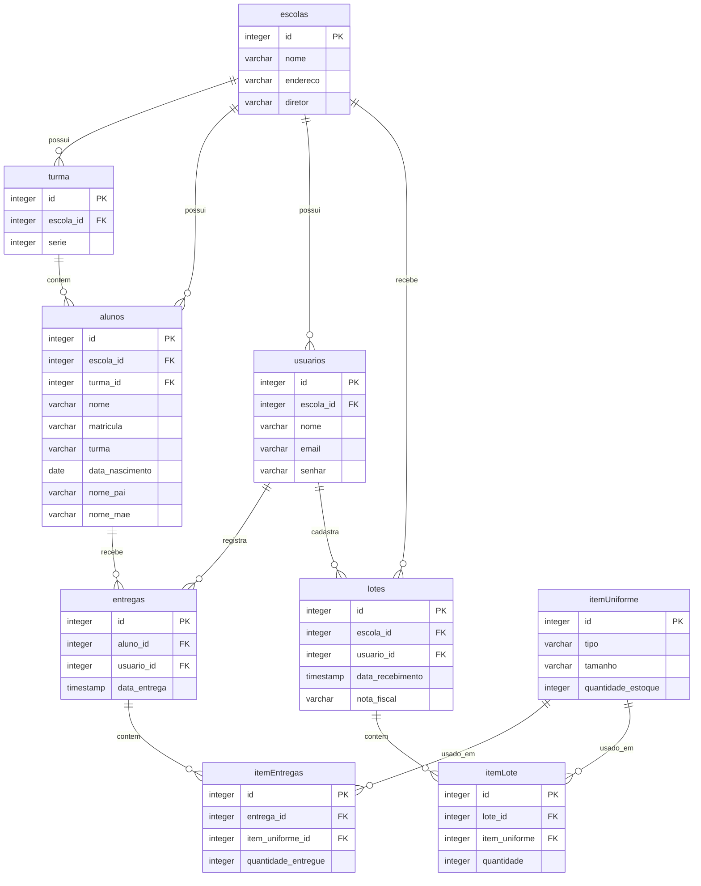

```mermaid
erDiagram

escolas {
    integer id PK
    varchar nome
    varchar endereco
    varchar diretor
}

turma {
    integer id PK
    integer escola_id FK
    integer serie
}

alunos {
    integer id PK
    integer escola_id FK
    integer turma_id FK
    varchar nome
    varchar matricula
    varchar turma
    date data_nascimento
    varchar nome_pai
    varchar nome_mae
}

usuarios {
    integer id PK
    integer escola_id FK
    varchar nome
    varchar email
    varchar senhar
}

entregas {
    integer id PK
    integer aluno_id FK
    integer usuario_id FK
    timestamp data_entrega
}

itemEntregas {
    integer id PK
    integer entrega_id FK
    integer item_uniforme_id FK
    integer quantidade_entregue
}

lotes {
    integer id PK
    integer escola_id FK
    integer usuario_id FK
    timestamp data_recebimento
    varchar nota_fiscal
}

itemLote {
    integer id PK
    integer lote_id FK
    integer item_uniforme FK
    integer quantidade
}

itemUniforme {
    integer id PK
    varchar tipo
    varchar tamanho
    integer quantidade_estoque
}

escolas ||--o{ turma : "possui"
escolas ||--o{ alunos : "possui"
turma ||--o{ alunos : "contem"
escolas ||--o{ usuarios : "possui"
alunos ||--o{ entregas : "recebe"
usuarios ||--o{ entregas : "registra"
entregas ||--o{ itemEntregas : "contem"
itemUniforme ||--o{ itemEntregas : "usado_em"
escolas ||--o{ lotes : "recebe"
usuarios ||--o{ lotes : "cadastra"
lotes ||--o{ itemLote : "contem"
itemUniforme ||--o{ itemLote : "usado_em"
```
