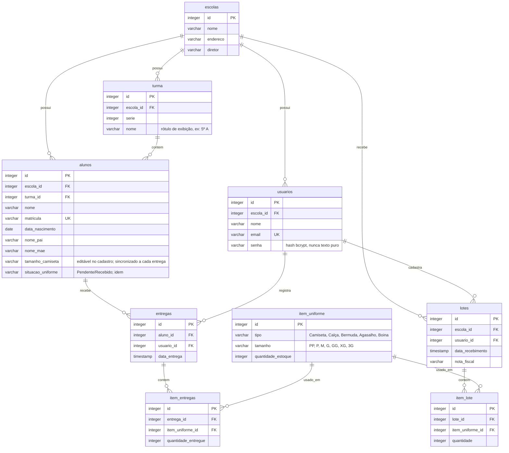

## Observações / decisões de modelagem

- **`turma.nome`** foi adicionado além de `serie` porque o frontend precisa exibir turmas
  com letra de seção (ex: "5º A", "5º B"), e o ERD original só previa a série numérica.
- **`alunos.tamanho_camiseta` e `alunos.situacao_uniforme` são colunas reais e editáveis**
  (histórias da Sprint pedem esses campos como Select no cadastro do aluno — ver o handoff
  de design). Para não desatualizar esse dado sozinho, o backend também os **sincroniza
  automaticamente** toda vez que uma entrega é registrada (`POST /entregas` atualiza
  `situacao_uniforme` para "Recebido" e `tamanho_camiseta` se uma camiseta fizer parte da
  entrega — ver `routers/entregas.py`). `GET /alunos` ainda calcula `idade`, `turma` e
  `escola` "achatados" a partir de outras tabelas, e cai de volta para o histórico de
  entregas caso os dois campos acima estejam em branco (ex.: aluno antigo).
- **`usuarios.senha`** guarda o hash bcrypt da senha, nunca o texto puro.
- **Diferença entre `entradas` (lotes) e `entregas`:** uma *entrada* é o recebimento de um
  lote de uniformes do governo/fornecedor (soma no estoque); uma *entrega* é a distribuição
  de peças do estoque para um aluno específico (debita o estoque). São conceitos e tabelas
  separados de propósito.
